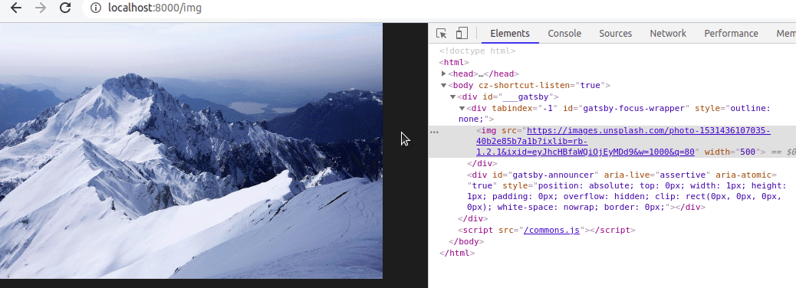

I am sure that you already found a website with an image not loading, maybe you don't really cared that much, but a lot of users care and find it very irritating. It's something incredible simple to solve, that adds a solid value to your application/website.

To start off, let's build a simple Image React component with Typescript.

```jsx
interface Props {
  url: string;
};

const Image: React.FC<Props> = ({url, ...rest}) => (
  
);

```

As you can see, it's just a component that returns a `img` tag, now to add the fallback url we can use the property `onError` that the `img` tag has and almost no one knows about it.

```jsx
interface Props {
  url: string;
  fallback?: string;
};

const handleImageError = fallback => event => event.target.src = fallback;

const Image: React.FC<Props> = ({url, fallback, ...rest}) => (
  
);

```

So if the main url fails, it will change the `src` from the image to the passed fallback url, which could be for example a default image. And it works! you can already try it, check the gif below on how to manually test it.



Just change the URL to something non-existent and you will see that it will change the image source to the fallback one.   
Now, how to test it with Jest? After long and painful hours of trying to test it properly, I found (with the help of the community), a not-too-bad solution, it's not the best, but at least we can test it properly.

```jsx
import React from 'react';
import '@testing-library/jest-dom/extend-expect';
import { render, fireEvent, screen } from '@testing-library/react';
import Image from '..';

const imageUrl = 'https://images.unsplash.com/photo-1531436107035-40b2e85b7a1b?ixlib=rb-1.2.1&amp;ixid=eyJhcHBfaWQiOjEyMDd9&amp;w=1000&amp;q=80';
const fallbackUrl = 'https://images.unsplash.com/photo-1549880338-65ddcdfd017b?ixlib=rb-1.2.1&ixid=eyJhcHBfaWQiOjEyMDd9&auto=format&fit=crop&w=750&q=80';
const imageErrorUrl = 'error://test';

describe('Image', () => {
  it('should render the fallback image if the main one has an error', () => {
    render(
      <Image
        src={imageErrorUrl}
        fallback={fallbackUrl}
      />
    );

    const image = screen.getByRole("img");
    expect(image).toHaveAttribute('src', imageErrorUrl);
    fireEvent.error(image); // Here we trigger the error event
    expect(image).toHaveAttribute('src', fallbackUrl); // and check if the src changed
  });
});

```
Remembering we need the `@testing-library/jest-dom/extend-expect` to be able to use the `toHaveAttribute` property.
It's a simple test, we are getting the image tag, forcing an error event to happen there, and checking if the image `src` has changed to the `fallbackUrl`.

That's it! now you have a simple image component with a fallback, that you can reuse it in your application.